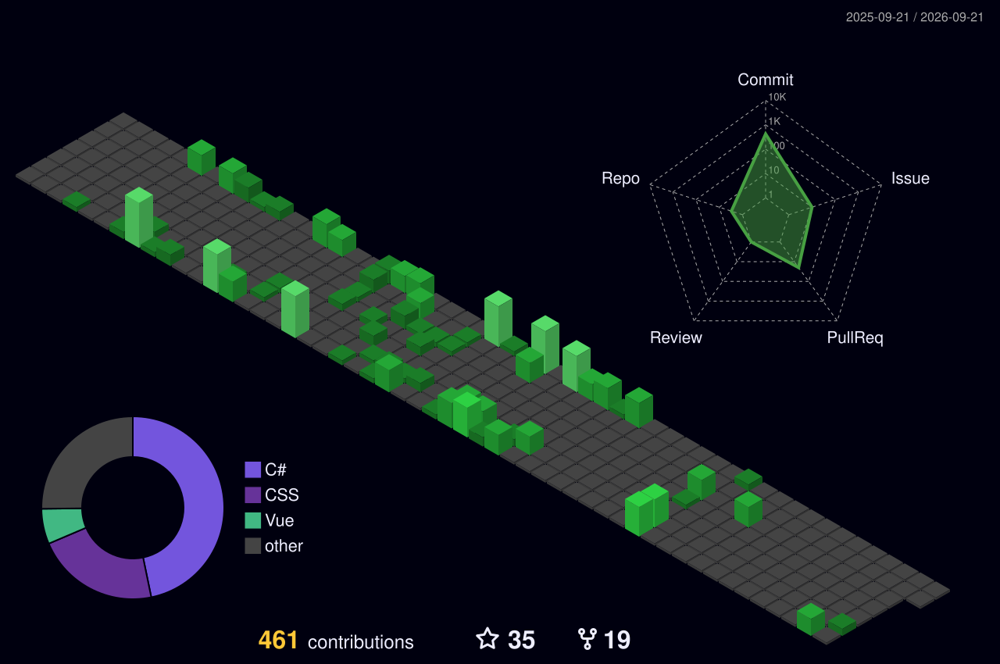

## 你好 

我是 Jiugulixiaoniu，一个福建省南平市在读初中生。我很爱写一些小东西

## 总览

[]

  
更多

  
   ## 📺 我的B站信息
  
  **昵称**: [旧故里小牛](https://space.bilibili.com/3546617818909179)  
  **简介**: 初中生，喜欢编程和游戏  
  **粉丝**: 136位  
  
  **[🚀 前往我的B站主页 →](https://space.bilibili.com/3546617818909179)**

## 项目

我创建的/我主要参与的项目：

- **[Class-Website-V2.5 ](https://github.com/jiugulixiaoniu/Class-Website-V2.5)**
   
- **[ClassScreenLock ](https://github.com/jiugulixiaoniu/ClassScreenLock)**
   

## 开发

- 我主要使用的编程语言： 
  
  
  
  
- 我主要使用的框架： 
  
- 我主要使用的开发工具： 
  
  
  
  
  
